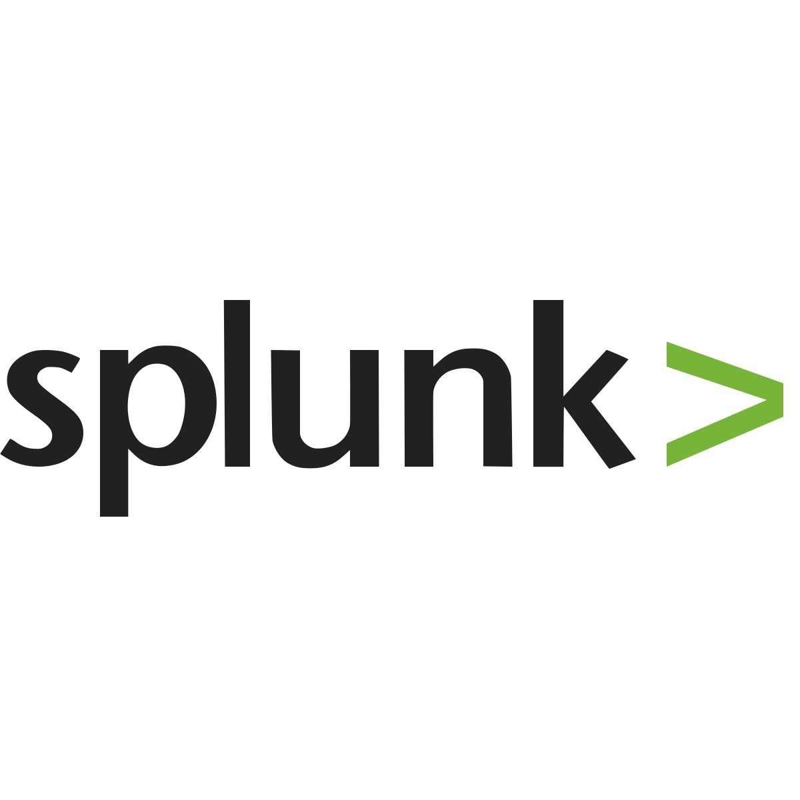

<p align="center">
    
</p>

<h2 align="center">Hi There</h2>
<p align="center">My name is Hari and welcome to my github profile</p>

```zsh
-> ~/Portfolio git:(main) > ./start.sh
```


```csharp
    Human Information
    ------------------------------------------
    Name: Hariharan 
    Nickname: H3isenberg
    Gender: Male
    Age: 20
    Hobbies: ["Movies"], ["Hacking"], ["Gaming"], ["Music"]
    Languages: ["Tamil"], ["English"]
    Location: TamilNadu, India
```

<br>

<div align="center">
    <table align="left">
        <tr>
            <td align="center" width="140" height="112.43">
                
                <br /> Splunk
            </td>
            <td align="center" width="140" height="112.43">
                
                <br /> Wireshark
            </td>
            <td align="center" width="140" height="112.43">
                
                <br /> Javascript
            </td>
        </tr>
        <tr>
            <td align="center" width="140" height="112.43">
                
                <br /> Postgresql
            </td>
            <td align="center" width="140" height="112.43">
                
                <br /> Python
            </td>
            <td align="center" width="140" height="112.43">
                
                <br /> Wazuh
            </td>
        </tr>
    </table>
    
</div>

<br>


```csharp
-> ~/heisenberg/cyberlab > cat profile.txt

Status: Cybersecurity Student

Current Focus:
    - SOC Operations
    - Blue Teaming
    - Log Analysis

Interests:
    - Threat Detection
    - Malware Analysis
    - DFIR

Learning Path:
    - TryHackMe
    - Security Labs
    - Blue Team Tools

Long Term Goal:
    Digital Forensics
    & Incident Response

Mission:
    Detect -> Analyze
    Investigate -> Respond
```
